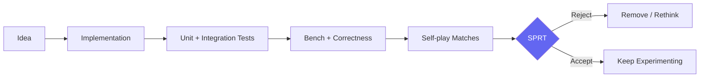
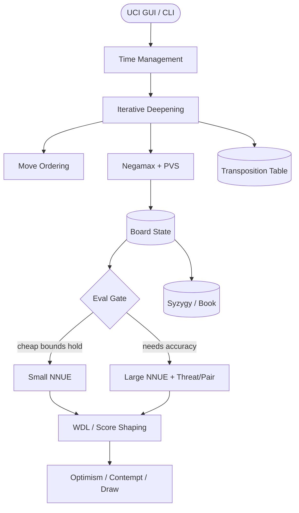

<p align="center">
  <strong>A readable, hackable Rust chess engine built to explore how a modern NNUE engine comes together.</strong>
</p>

<p align="center">
  <a href="https://github.com/niaowniaow/whale">
    
  </a>
</p>

<p align="center">
  <a href="https://github.com/niaowniaow/whale/actions/workflows/pipeline.yml">
    
  </a>
  <a href="https://www.rust-lang.org/">
    
  </a>
  <a href="https://github.com/official-stockfish/Stockfish">
    
  </a>
  <a href="https://en.wikipedia.org/wiki/Universal_Chess_Interface">
    
  </a>
  <a href="LICENSE">
    
  </a>
  <a href="https://github.com/niaowniaow/whale/pulls">
    
  </a>
  <a href="https://github.com/niaowniaow/whale/stargazers">
    
  </a>
</p>

|  |  |
|---|---|
| ♟️ Protocol | UCI — works with Cute Chess, Arena and other GUIs |
| 🦀 Language | Rust 1.95+, search threads on 16 MB stacks |
| 🧠 Evaluation | Embedded small NNUE + optional large Stockfish-style net |
| 🔎 Search | Iterative deepening, PVS/NegaScout, LMR, Lazy SMP |
| 🧪 Laboratory | 14 individually toggleable heuristics + SPRT workflow |
| 📜 License | GPL-3.0 |

<p align="center">
  <a href="#-what-is-whale">About</a>
  &nbsp;·&nbsp;
  <a href="#-feature-tour">Features</a>
  &nbsp;·&nbsp;
  <a href="#-getting-started">Quickstart</a>
  &nbsp;·&nbsp;
  <a href="#-uci-options">UCI Options</a>
  &nbsp;·&nbsp;
  <a href="#-project-layout">Layout</a>
  &nbsp;·&nbsp;
  <a href="#-acknowledgements">Thanks</a>
</p>

---

## ♟️ What is Whale?

**Whale** is a UCI chess engine written in Rust.

It is designed to be more than a chess-playing program. Whale is a **readable engineering playground** where the major pieces of a modern chess engine live together in one place:

```text
                   ┌─────────────────────┐
                   │       UCI           │
                   │  GUI / CLI / Match  │
                   └──────────┬──────────┘
                              │
                              ▼
                   ┌─────────────────────┐
                   │       SEARCH        │
                   │ Alpha-Beta / PVS    │
                   │ Pruning / LMR / SMP │
                   └──────────┬──────────┘
                              │
                    ┌─────────┴─────────┐
                    ▼                   ▼
          ┌─────────────────┐   ┌─────────────────┐
          │      BOARD      │   │   EVALUATION    │
          │ Bitboards       │   │ NNUE            │
          │ Movegen         │   │ WDL             │
          │ SEE / Zobrist   │   │ Optimism        │
          └────────┬────────┘   └────────┬────────┘
                   │                     │
                   └──────────┬──────────┘
                              ▼
                   ┌─────────────────────┐
                   │   ENDGAMES / BOOK   │
                   │ Syzygy / EPD Book   │
                   └─────────────────────┘
```

The goal is simple:

> **Make the engine understandable enough to hack, but complete enough to become genuinely interesting.**

Whale started as a fork of [`znxftw/rudim`](https://github.com/znxftw/rudim). Since then, the core engine has been extensively rebuilt across the board representation, search pipeline, evaluation architecture and NNUE plumbing.

See [Acknowledgements](#-acknowledgements) for the projects Whale learns from.

---

# 🌊 Feature Tour

## 🧩 Board & Move Generation

Located primarily in `src/board/` and `src/bitboard/`.

Whale's board layer is designed around fast incremental state updates and predictable move generation.

* **64-bit bitboards** with precomputed attack tables
* **Magic bitboards** for sliding-piece attacks
* Magic regeneration via `--generate-magics`
* Staged move picking:

  * hash move
  * good captures
  * killers
  * counter moves
  * quiet moves
  * bad captures
* Exact boolean **SEE** via `see_ge`
* Early exits for clearly winning exchanges
* Incremental **Zobrist hashing**
* Repetition detection
* Standard castling handling
* Incremental make/unmake infrastructure

The board layer aims to keep one rule in mind:

> **Do the expensive work once, then reuse it everywhere.**

---

# 🔎 Search

Located in `src/search/` (`negamax/`, `iterative_deepening/`, …).

Whale uses an iterative, heavily heuristic alpha-beta search architecture designed for experimentation.

### Core search

* Iterative deepening
* Aspiration windows
* Principal Variation Search
* NegaScout
* Quiescence search
* Transposition tables
* Mate-distance handling
* 50-move-rule score adjustment

### Pruning & reductions

Whale includes a broad collection of classical search techniques:

* Razoring
* Reverse futility pruning
* Null-move pruning
* Null-move zugzwang verification
* ProbCut
* Internal iterative reduction
* Late-move pruning
* Futility pruning
* SEE pruning
* Singular extensions
* History-driven LMR
* Extension caps
* Threat-conditioned extensions

### Move ordering

Whale tracks multiple history families:

* Killer moves
* Main history
* Counter moves
* Capture history
* Continuation histories
* Correction histories

Good move ordering is not a side effect of search.

**It is search.**

---

# ⚙️ Parallel Search

Whale currently supports two worker models.

### Lazy SMP

The default mode.

Multiple workers independently explore the tree while sharing the transposition table and other useful state.

```text
                Root
                 │
       ┌─────────┼─────────┐
       ▼         ▼         ▼
    Worker 1  Worker 2  Worker 3   ...
       │         │         │
       └─────────┼─────────┘
                 ▼
             Shared TT
```

### Root Splitting

An opt-in split-at-root implementation is available through:

```text
SplitRoot_Enabled
```

Search workers use **16 MB stacks**:

```text
SEARCH_THREAD_STACK_SIZE = 16 MB
```

This is also reflected in the test environment through:

```text
RUST_MIN_STACK=16777216
```

---

# 🧠 Evaluation

Located in `src/eval/`.

Whale supports a layered evaluation architecture instead of relying on a single static score.

## Small NNUE

Whale ships with an embedded small network featuring:

* Incremental evaluation
* Dual accumulators
* Evaluation caching

It is intended to provide a lightweight baseline that builds and runs easily.

## Large NNUE

Whale can optionally load a larger Stockfish-style network from:

```text
models/whale_*.nnue
```

The larger architecture supports:

* Threat features
* Pair features
* Incremental accumulators
* Custom external network loading

When available, the large network can be gated through the cheap network using:

```text
DualNet = true
```

This lets the engine avoid paying the full evaluation cost when the cheaper evaluation already provides sufficient information.

---

# 🎯 Beyond Raw Evaluation

Whale experiments with several additional score-shaping systems.

### Search-aware evaluation

* Depth-conditioned blending
* Material-aware optimism
* Contempt
* Draw-score controls
* WDL reporting

### Experimental game-state models

The engine contains additional modules under:

```text
src/lab/
```

These modules can influence:

* Pruning
* Extensions
* Move ordering
* Time allocation
* Conversion decisions
* Tactical aggression
* Defensive behavior

They are intentionally modular so that each idea can be tested independently.

---

# 🧪 Experimental Search Lab

Whale is deliberately built as an experimentation platform.

Individual heuristics can be toggled at runtime and tested independently using A/B matches and SPRT.

Some experimental systems include:

| System         | Idea                               |
| -------------- | ---------------------------------- |
| **CFSS**       | Coarse-to-fine selective search    |
| **RAS**        | Runtime annealing for LMR          |
| **BMO**        | Bandit move ordering               |
| **TCE**        | Threat-conditioned extensions      |
| **LQT**        | Tactical quiescence control        |
| **SPS**        | Speculative persona search         |
| **DAD**        | Disagreement-based time factor     |
| **CPI**        | Counterplay intelligence           |
| **State**      | Game-state shaping                 |
| **Risk**       | Risk-aware search behavior         |
| **Pressure**   | Pressure modelling                 |
| **Attack**     | Attack-oriented search shaping     |
| **Conversion** | Position conversion logic          |
| **Conspiracy** | Root-level conspiracy verification |

The philosophy is straightforward:

> **An idea is not “good” because it sounds clever. It survives only if measurement says it survives.**

Use **SPRT** before promoting a strength-related change.

---

# 🏁 Endgames & Openings

## ♚ Syzygy

Whale supports Syzygy tablebases through:

[`shakmaty-syzygy`](https://crates.io/crates/shakmaty-syzygy)

The engine probes WDL bounds when tablebases are available.

Smoke-test material is included under:

```text
tables/K*vK
```

Configure the directory with:

```text
setoption name SyzygyPath value <path>
```

---

## 📖 Opening Book

Whale can probe an EPD opening book at the root.

The bundled book lives at:

```text
resources/openings.epd
```

Book controls are exposed through UCI:

```text
UseBook
BookFile
BookDepth
```

---

# 🧰 Under the Hood

<p align="center">
  
</p>

<p align="center">
  <a href="https://github.com/niaowniaow/whale">
    
  </a>
</p>

# 🚀 Getting Started

## Prerequisites

Install a recent stable Rust toolchain.

**Minimum supported Rust version:**

```text
1.95+
```

Install Rust through [rustup](https://rustup.rs/).

---

## Build

```bash
cargo build --release
```

The resulting binary is:

```text
target/release/whale
```

On Windows:

```text
target/release/whale.exe
```

---

## Optional Features

### Training / data generation

```bash
cargo build --release --features train
```

Enables self-play data generation and Bullet trainer plumbing.

### CUDA training

```bash
cargo build --release --features cuda
```

Enables CUDA-related training support.

> The first build downloads the default small NNUE weights through `build.rs`, so network access must be available during the initial build.

---

# ▶️ Running Whale

### UCI engine

```bash
cargo run --release
```

Whale can communicate with UCI-compatible interfaces such as:

* Cute Chess
* Arena
* Other UCI GUIs and match runners

### Benchmark

```bash
cargo run --release -- bench
```

Example output (Intel i3-N305, release build, 12 positions at depth 12):

```text
Total: 1635021 nodes 4648 ms 351766 nps
```

<details>
<summary><strong>▶️ See a real UCI session</strong></summary>

```text
> uci
id name Whale 0.1.0
id author Vishnu B
uciok
> position startpos
> go depth 10
info depth 8 seldepth 24 score cp 80 ...
info depth 9 seldepth 24 score cp 70 ...
info depth 10 seldepth 24 score cp 70 ... nodes 56067 time 374 nps 149911 pv e2e4 ...
bestmove e2e4 ponder e7e5
```

</details>

### Profiling

```bash
cargo run --release -- --profile
```

### Regenerate magic tables

```bash
cargo run --release -- --generate-magics
```

---

# 🧬 Data Generation

Requires:

```text
--features train
```

### Self-play

```bash
cargo run --release --features train -- \
  datagen <out.binpack> <games> <book.fen> [depth] [threads]
```

### Teacher-guided generation

```bash
cargo run --release --features train -- \
  datagen-teacher <out.binpack> <games> <book.fen> [depth] [threads] <stockfish>
```

This provides a foundation for experimenting with generated training data and teacher-guided datasets.

---

# 🎛️ UCI Options

<details>
<summary><strong>Click to expand the full option table</strong></summary>

| Option                  |  Type  |    Default   | Description                              |
| ----------------------- | :----: | :----------: | ---------------------------------------- |
| `Hash`                  |  spin  |     `16`     | Transposition table size in MB, `1–2048` |
| `Threads`               |  spin  |      `1`     | Search threads, `1–256`                  |
| `Move Overhead`         |  spin  |     `10`     | Clock-latency buffer in milliseconds     |
| `SyzygyPath`            | string |   `<empty>`  | Directory containing Syzygy files        |
| `EvalFile`              | string | `<embedded>` | Custom NNUE weights                      |
| `EvalFileSmall`         | string |   `<empty>`  | Legacy small-network option              |
| `Contempt`              |  spin  |      `0`     | Draw aversion in centipawns              |
| `DrawScore`             |  spin  |      `0`     | Absolute draw score override             |
| `ShowWDL`               |  check |    `true`    | Emit WDL information                     |
| `MultiPV`               |  spin  |      `1`     | Number of root lines, `1–8`              |
| `UseBook`               |  check |    `true`    | Enable opening book                      |
| `BookFile`              | string |   `<empty>`  | EPD opening book path                    |
| `BookDepth`             |  spin  |     `30`     | Maximum book depth                       |
| `DualNet`               |  check |    `true`    | Gate large network on cheap-net bounds   |
| `Clear Hash`            | button |      `-`     | Clear transposition table                |
| `CFSS_Enabled`          |  check |    `true`    | Coarse-to-fine selective search          |
| `RAS_Enabled`           |  check |    `true`    | Runtime LMR annealing                    |
| `BMO_Enabled`           |  check |    `true`    | Bandit move ordering                     |
| `TCE_Enabled`           |  check |    `true`    | Threat-conditioned extensions            |
| `LQT_Enabled`           |  check |    `true`    | Tactical quiescence control              |
| `SPS_Enabled`           |  check |    `true`    | Speculative persona search               |
| `DAD_Enabled`           |  check |    `true`    | Disagreement-based time factor           |
| `Extension_Cap_Enabled` |  check |    `true`    | Cap consecutive extensions               |
| `Razor_Enabled`         |  check |    `true`    | Frontier razoring                        |
| `Razor_Margin`          |  spin  |     `350`    | Razoring margin                          |
| `IIR_Enabled`           |  check |    `true`    | Internal iterative reduction             |
| `NMP_Verify`            |  check |    `true`    | Null-move verification                   |
| `NMP_Verify_Margin`     |  spin  |     `150`    | Null-move verification margin            |
| `Conspiracy_Enabled`    |  check |    `false`   | Root conspiracy verification             |
| `Conspiracy_Tolerance`  |  spin  |     `30`     | Conspiracy tolerance                     |
| `SplitRoot_Enabled`     |  check |    `false`   | Root splitting instead of Lazy SMP       |
| `CPI_Enabled`           |  check |    `true`    | Counterplay shaping                      |
| `State_Enabled`         |  check |    `true`    | State-aware shaping                      |
| `Risk_Enabled`          |  check |    `true`    | Risk-aware search                        |
| `Pressure_Enabled`      |  check |    `true`    | Pressure modelling                       |
| `Attack_Enabled`        |  check |    `true`    | Attack shaping                           |
| `Conversion_Enabled`    |  check |    `true`    | Conversion shaping                       |
| `MustTryGain`           |  spin  |     `30`     | Must-try tactical gain threshold         |
| `MustTryRisk`           |  spin  |     `120`    | Must-try tactical risk threshold         |
| `ConvertScore`          |  spin  |     `250`    | Conversion threshold                     |
| `CrushScore`            |  spin  |     `600`    | Crushing-position threshold              |
| `DefendCPI`             |  spin  |     `120`    | Defensive CPI threshold                  |

</details>

---

# 🧪 Testing & Quality

Whale treats engine strength and correctness as separate things that must both be measured.

[](https://github.com/niaowniaow/whale/actions/workflows/pipeline.yml)

## Full quality gate

```bash
make quality
```

This covers:

```text
format
lint
unit tests
integration tests
coverage
```

## Targeted tests

```bash
cargo test --lib
```

```bash
cargo test --release --test aprm
```

```bash
cargo test --release --test aprm_suite
```

```bash
cargo test --release --test epd_suite
```

```bash
cargo test --release -- bench
```

### Deep-search tests

Because search threads run with large stacks, deep-search test environments use:

```text
RUST_MIN_STACK=16777216
```

If a manual `cargo test` run encounters stack overflow during deep-search tests, export that variable first.

---

# 📊 Tuning & Match Infrastructure

Strength experiments live under:

```text
tools/
```

Available tooling includes:

* SPSA tuning
* Texel tuning
* SPRT runner
* A/B self-play match harness (`tools/sprt_match.py`) with adjudication

The intended workflow is:



This keeps the project focused on **measurable improvements rather than feature-count inflation**.

---

# 🗂️ Project Layout

```text
whale/
│
├── src/
│   ├── bitboard/        # Bitboards, magics, attack tables
│   ├── board/           # State (+ state/tables, core, attacks, cache, legality),
│   │                    # movegen, make/unmake, SEE, FEN, history, NNUE glue
│   ├── search/          # Negamax (+ core, early, moves, history, pvs, context),
│   │                    # iterative deepening (+ core, aspiration, diagnostics,
│   │                    # timing, reporting, workers, roots), quiescence,
│   │                    # LMR, TT, move ordering, heuristics
│   ├── eval/            # NNUE (+ nnue/v16: arch, position, threats, pairs,
│   │                    # loader, inference, eval), optimism, WDL, histories
│   ├── uci/             # UCI loop, position, go, setoption, time management
│   ├── lab/             # world, risk, opportunity, opponent, perception,
│   │                    # endgame, root — game-state shaping
│   └── syzygy.rs        # Tablebase probing
│
├── src/datagen.rs       # Self-play data generation (feature `train`)
├── src/teacher.rs       # Teacher-guided data generation
├── src/train.rs         # Training plumbing
│
├── tests/               # Perft, search, APRM, EPD, eval equivalence
├── tools/               # SPSA, Texel, SPRT, match tooling
├── examples/            # Perf probe harness
├── models/              # Large NNUE networks
├── tables/              # Syzygy K*vK smoke files
├── data/                # Benchmarks & opening data
├── resources/           # openings.epd and engine resources
│
├── build.rs
├── Cargo.toml
└── LICENSE
```

---

# 🧭 Architecture at a Glance



---

# 🔬 Design Philosophy

Whale is built around a few principles.

### Readability first

The code should remain understandable enough for someone to trace a move from:

```text
UCI
 → search
 → move picker
 → make move
 → evaluation
 → unmake move
 → back to search
```

without needing to decode a giant abstraction maze.

### Performance matters

Whale is still a chess engine, not a teaching toy.

Critical paths are designed around:

* Cache-friendly data
* Incremental updates
* Efficient bitboard operations
* Aggressive but measurable pruning
* Fast NNUE evaluation
* Parallel search

### Experiments must be switchable

Experimental heuristics should be possible to enable or disable individually.

That makes the engine a laboratory instead of a pile of permanently entangled experiments.

### Strength must be measured

A search change that sounds brilliant but loses Elo is still a failed experiment.

Use:

```text
Bench
Perft
EPD
APRM
Self-play
SPRT
```

before trusting a change.

---

# 🐋 Why "Whale"?

Chess engines spend much of their time exploring a huge search space.

Whale is named around that idea:

```text
                    Search Space
                ~~~~~~~~~~~~~~~~~~~~~
             ~~~~~~~~~~~~~~~~~~~~~~~~~~~
          ~~~~~~~~~~~~~~~~~~~~~~~~~~~~~~~~~
        ~~~~~~~        ♟        ~~~~~~~~~~~~
      ~~~~~~~~      ♟     ♟       ~~~~~~~~~~~
        ~~~~~~~~       ♟         ~~~~~~~~~~~
             ~~~~~~~~~~~~~~~~~~~~~~~~~~~
                ~~~~~~~~~~~~~~~~~~~~~
                       🐋
```

A whale is large enough to suggest scale, but the name is intentionally simple.

The project is not trying to hide behind a grand mythology.

It is here to **swim through the search tree**.

---

# 🤝 Acknowledgements

Whale stands on the shoulders of several excellent open-source projects.

### [`znxftw/rudim`](https://github.com/znxftw/rudim)

The project Whale originally forked from.

Its role goes beyond simply providing a starting repository. Whale's current core has since been substantially rebuilt across the board, search and evaluation systems.

### [`Stockfish`](https://github.com/official-stockfish/Stockfish)

A major reference for:

* Search techniques
* Evaluation architecture
* NNUE
* Correctness testing
* Engine benchmarking

### [`Reckless`](https://github.com/codedeliveryservice/Reckless)

A source of inspiration for high-performance Rust engine architecture and implementation patterns.

### [`Lc0`](https://github.com/LeelaChessZero/lc0)

A source of ideas around:

* Contempt
* Draw scoring
* WDL reporting
* Modern engine experimentation

### [`nnue-pytorch`](https://github.com/official-stockfish/nnue-pytorch)

The NNUE training ecosystem used as a reference for network training and architecture work.

### [`Bullet`](https://github.com/jw1912/bullet)

An alternative NNUE training backend currently explored for training experiments.

---

# 📜 License

Whale is licensed under the:

**GNU General Public License v3.0**

See [`LICENSE`](LICENSE).

---

# ⭐ The Project in One Sentence

> **Whale is a Rust chess engine built to make modern engine architecture understandable, measurable, and hackable.**

<p align="center">
  ♟️ <strong>Build.</strong>
  &nbsp;·&nbsp;
  🔬 <strong>Experiment.</strong>
  &nbsp;·&nbsp;
  📈 <strong>Measure.</strong>
  &nbsp;·&nbsp;
  🐋 <strong>Swim deeper.</strong>
</p>


